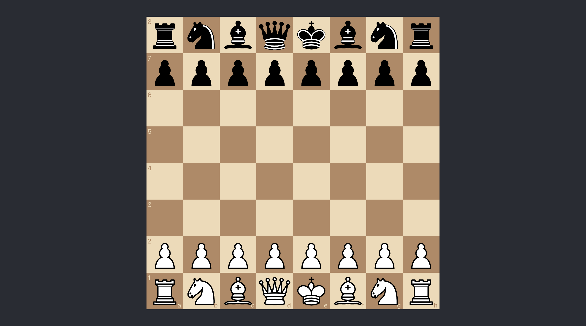

# chess-engine

A playable chess board where a small engine answers your moves.



## What it does

- Full chess rules via `chess.js`: castling, en passant, promotion, draws.
- Drag and drop a piece; the engine replies as the other side.
- Minimax with alpha-beta pruning and a simple material evaluation.
- Checkmate is scored, so it prefers the shortest forced win.

## Stack

React 19, TypeScript, `chess.js`, `react-chessboard`, Create React App, Jest.

## Run it

```bash
npm install
npm start        # http://localhost:3000
npm test         # engine tests
npm run build    # production build
```

## What was hard

The first version answered with random moves. A real answer meant separating
evaluation from the search and making minimax undo every move it plays, or the
position drifts between branches. The tests pin three things now: a legal move
from the start, a mate in one, and capturing a hanging queen.
